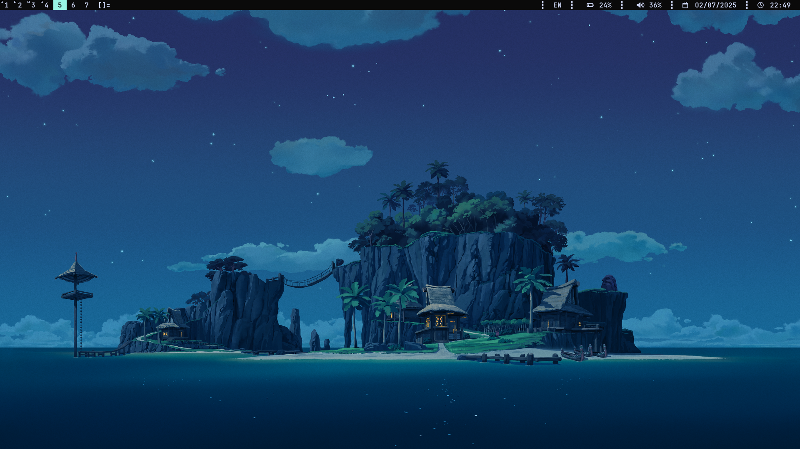

*Минималистичный оконный менеджер для Arch Linux*

---

## 📦 Зависимости
Установите перед сборкой:
```bash
sudo pacman -S base base-devel git dmenu alacritty feh ttf-font-awesome rofi pipewire
```


---

## ⚙️ Установка

### 1. Для пользователей с другим DE/WM
Склонируйте репозиторий:
```bash
git clone https://github.com/jdunCode/dwm-config2.git
```
Скопируйте файлы вручную:
```bash
cp ~/dwm-config/startdwm.sh /usr/local/bin/
cp ~/dwm-config/temp/dwm.desktop /usr/local/share/xsessions/
make
sudo make install
```

### 2. Для чистого Arch (без DE)
Добавьте автозапуск в `~/.xinitrc`:
```bash
echo 'exec dwm' >> ~/.xinitrc
```

---

## ⌨️ Горячие клавиши
| Комбинация         | Действие                     |
|--------------------|-----------------------------|
| `Ctrl + Shift + d`     | Запуск Rofi (app launcher)  |
| `Ctrl + Shift + Esc`   | Power menu                  |
| `Super + Shift + Enter` | Открыть терминал|
| `Super + b`  | Скрыть/Показать dwmblocks    |
| `Super + Space`    | Смена раскладки (us/ru)    |

---

## 🖼️ Обои
1. Поместите ваше изображение в:  
   `~/dwm-config2/dwm/wallpapers/`
2. Переименуйте в `wp.jpg`

---

## 🔧 Кастомизация
### 1. Смена терминала
Отредактируйте ***termcmd** в `config.h`:
```c
static const char *termcmd[] = { "ваш_терминал", NULL };
```
> Примеры:  `kitty`, `st`, `alacritty`.

### 2. Пересборка после изменений
```bash
make clean install
```
---
## 🔧 Особенности
- Патчи: vanitygaps, pertag, alwayscenter
- Готовые скрипты для быстрого старта

> 💡 Совет: Для кастомизации редактируйте `config.h` и пересобирайте dwm:
> ```bash
> make clean install
> ```
